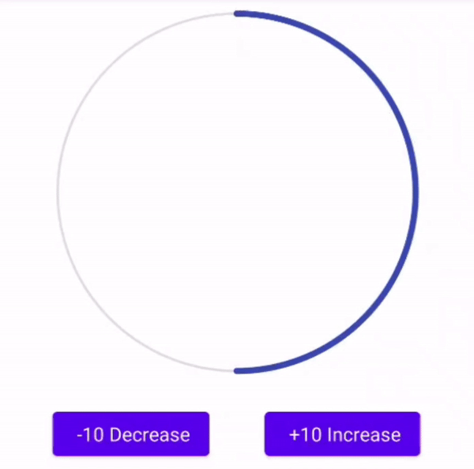
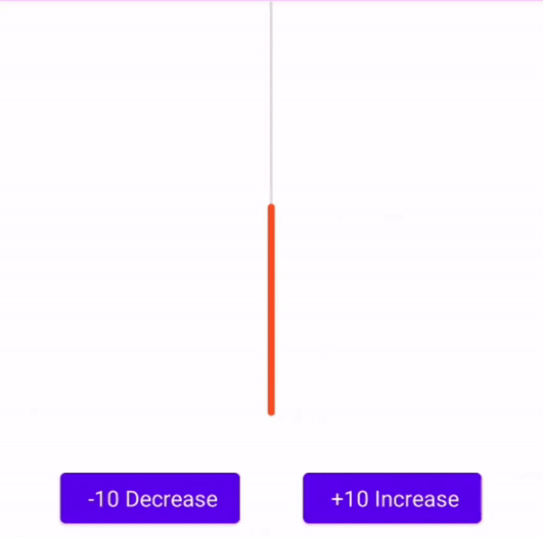
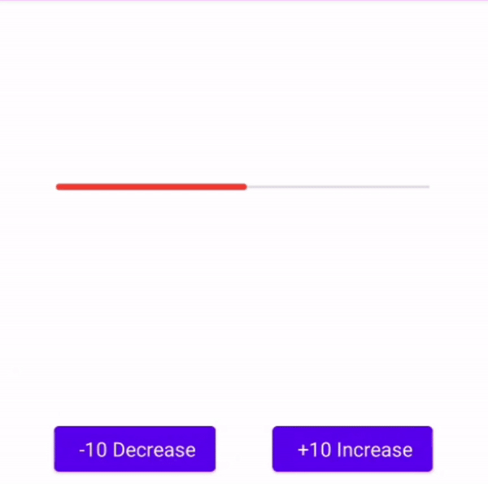

# MBAndroidProgressBar
An animated ProgressBar library that works in Circular, Vertical or Horizontal

# Download

# Usage

### General Usage
You can customize your progress bars background and foreground

For foreground;
Color =  **app:fgColor="your color"**
Thickness = **app:fgWidth="your thickness value"**

For background;
Color = **app:bgColor="your color"**
Thickness = **app:bgWidth="your thickness value"**

You can set min and max values with **app:min="your min value"** and **app:max="your max value"** parameters.

If you want to update progress value with animation, use **setProgressWithAnimation(your progress value)** function.

## Circular Progress Bar

### Add circular progress bar to your layout xml

    <com.mobven.progress.MBCircularProgressBar
		  android:id="@+id/circular_progress_bar"
		  android:layout_width="300dp"
		  android:layout_height="300dp"
		  app:fgColor="#3F51B5"
		  app:bgColor="#E0E0E0"
		  app:progress="50"
		  app:max="100"
		  app:min="0"/>

## Vertical Progress Bar

### Add vertical progress bar to your layout xml

    <com.mobven.progress.MBVerticalProgressBar
		  android:id="@+id/vertical_progress_bar"
		  android:layout_width="3000dp"
		  android:layout_height="300dp"
		  app:fgColor="#FF5722"
		  app:bgColor="#E0E0E0"
		  app:progress="50"
		  app:max="100"
		  app:min="0"/>

## Horizontal Progress Bar

### Add horizontal progress bar to your layout xml

    <com.mobven.progress.MBHorizontalProgressBar
		  android:id="@+id/horizontal_progress_bar"
		  android:layout_width="300dp"
		  android:layout_height="300dp"
		  app:fgColor="#F44336"
		  app:bgColor="#E0E0E0"
		  app:progress="50"
		  app:max="100"
		  app:min="0"/>